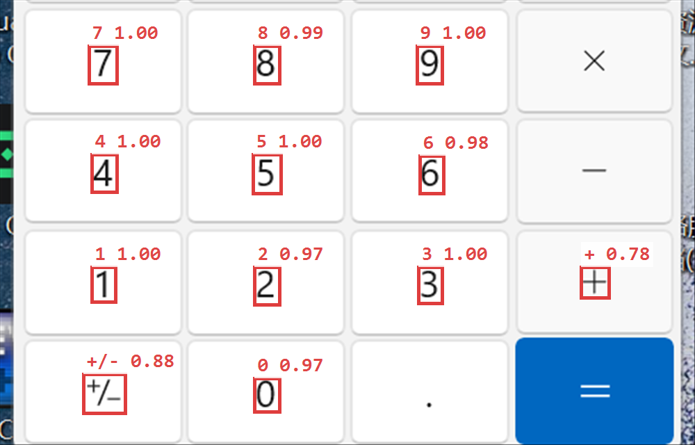

# guarded-computer-use-mcp

**Give your agent hands — without giving away the keys.**

A Windows computer-use MCP server where every risky action **stops and waits for a
real human click**. 26 tools: screenshot, mouse, keyboard, UI Automation, OCR,
windows, clipboard.

[中文文档](README.zh-CN.md)

---

> [!WARNING]
> **This server moves your real mouse and keyboard, with your user's privileges,
> on your real desktop. There is no sandbox and no undo.**
>
> It can send messages as you, delete files, and read everything on your screen —
> and what it reads is transmitted to your model provider.
>
> The approval gate and the policy lists reduce the blast radius. They do not
> eliminate it. Read **[Risks and disclaimer](#risks-and-disclaimer)** before you
> point an agent at this.

---

## Why

Most computer-use tools hand the model a keyboard and hope for the best. That is
fine until the model mis-clicks into a chat window, an email, or a payment page —
and there is no undo.

This one puts a gate in front of the dangerous part:


The MCP server **blocks** on that dialog and uses its exit code. Only a real
human action can proceed — the model cannot forge one.

**Built so a stray keystroke cannot approve anything:**

| Key | Effect |
|---|---|
| `Enter` | **nothing** — deliberately unbound |
| `Esc` / window close | deny |
| `Alt+A` / click Allow | allow |
| no answer in time | auto-deny (countdown shown) |

The dialog also shows the **actual arguments** being executed
(`automationId=…`, `name=…`), follows your OS language (Chinese/English), beeps,
and stays on top. Tick *remember this target for this session* to stop being
asked about the same tool + target until the server restarts.

Exit codes: `0` allow once · `1` deny · `2` timeout · `3` dialog unavailable
(falls back to `pending_safety_check`) · `4` allow + remember for this session.

Flip it off any time when you don't want to be interrupted:

```
double-click  guard-panel.cmd      # the panel: three independent switches
double-click  toggle-approval.cmd  # quick toggle for the dialog only
```

The panel writes a marker file per switch, and the server reads them **on every
call** — changes apply instantly, no restart:

| Switch | Marker file | Off means |
|---|---|---|
| Approval dialog | `.approval-off` | risky actions return `pending_safety_check` instead of asking you |
| Deny lists | `.guard-off` | the deny lists and rate limit are skipped |
| Audit log | `.audit-off` | nothing is written to `audit.jsonl` |

They are independent: turning off the deny lists does **not** silently turn off
the dialog.


---

## Three layers of protection

| Layer | What it does | Can the model bypass it? |
|---|---|---|
| **Policy engine** (`policy.json`) | Refuses to touch deny-listed processes / window titles. Optional allow-list. Rate limit. | **No** — hard refusal, no override |
| **Approval gate** (`approval.ps1`) | Risky action → real dialog → waits for a human | **No** — needs a physical click |
| **Audit log** (`audit.jsonl`) | Every action + its target process, appended | — (after the fact) |

Target resolution uses **`WindowFromPoint`** — which window a click *actually*
lands on, not the foreground window:

```json
{ "blocked_by_policy": true, "reason": "target process is on the deny list",
  "detail": { "process": "ApplicationFrameHost", "title": "计算器",
              "matched": "applicationframehost" } }
```

### What is on the lists

Four lists, all substring matches (case-insensitive), all in `policy.json`:

| List | Behaviour | Default coverage |
|---|---|---|
| `deny_processes` (49) | **hard refusal, no override** | password managers, crypto wallets, `regedit`/`diskmgmt`/`diskpart`/`gpedit` |
| `deny_window_titles` (31) | **hard refusal** | `password`, `bank`, `pay`, `wallet`, `转账`, `验证码`, `seed phrase`, UAC |
| `approval_processes` (32) | every action pops the dialog | messaging (WeChat/QQ/Telegram/Slack…), mail, remote desktop (RDP/TeamViewer/AnyDesk…) |
| `approval_window_titles` (8) | every action pops the dialog | `send`, `发送`, `remote desktop` |

The split matters: a messaging app is **not** denied outright — you may want the
agent to read or summarise it — but nothing is clicked there without you saying
yes.

`npm run test:policy` checks the lists against 29 samples and fails on false
positives (a browser, Notepad, Blender and this repo's own harness must all pass
cleanly).

---

## Install

Requirements: **Windows 10/11**, **Node.js ≥ 18**.

```bash
git clone https://github.com/be1st6666/guarded-computer-use-mcp
cd guarded-computer-use-mcp
npm install
```

Optional but recommended: **PowerShell 7** (better UTF-8 and JSON handling).
The server falls back to Windows PowerShell 5.1 automatically.

Optional: **OCR** needs [`uv`](https://docs.astral.sh/uv/) on PATH. Everything
else works without it.

### Verify it works

```bash
npm test              # read-only tools; no side effects, safe to run any time
npm run test:policy   # the deny/approval lists, 29 samples
npm run test:typing   # activate_window + multi-line type_text (launches Notepad)
```

`npm test` prints a tick per tool plus its latency. If it lists tools and
`screenshot` returns an image, the server is wired up correctly.

### Configure your MCP client

<details open>
<summary>Claude Desktop / Cursor / any stdio MCP client</summary>

```json
{
  "mcpServers": {
    "computer": {
      "command": "node",
      "args": ["D:/path/to/guarded-computer-use-mcp/server.js"]
    }
  }
}
```
</details>

<details>
<summary>DeepSeek Harness (DSH)</summary>

Add to `$DSH_HOME/profiles/web/cordis.patch.yml`:

```yaml
- insert:
    - id: mcp-computer-use
      name: '@deepseek-ai/dsh-mcp-client'
      config:
        serverName: computer
        transport: stdio
        command: C:/Program Files/nodejs/node.exe
        args:
          - D:/path/to/guarded-computer-use-mcp/server.js
```

Tools appear as `mcp__computer__<name>`.
</details>

---

## Performance

Measured on a 2560×1600 display, median of 5–8 runs:

| Operation | Latency | Tokens returned |
|---|---|---|
| `cursor_position` / `active_window` | **1 ms** | 7–39 |
| `ui_tree` | **12 ms** | 38 |
| `zoom` region 480×150 | **25 ms** | **96** |
| `screen_hash` | **44 ms** | **9** |
| `screenshot` 900×562 | **58 ms** | 674 |
| `screenshot` 1600×1000 | **116 ms** | 2133 |
| `batch` (3 steps + screenshot) | **134 ms**, one round trip | 674 |
| `find_elements` | **209 ms** | 640 |
| `ocr` (warm worker) | **457 ms** | 554 |

The ~55 ms capture floor is the GPU→CPU readback of a full frame over GDI.

### Token economics

A screenshot costs ~2133 tokens. The alternatives cost far less:

| Instead of a full screenshot | Tokens | Saving |
|---|---|---|
| `screen_hash` — "did anything change?" | 9 | **237×** |
| `zoom` — only the region you need | 96 | 22× |
| `find_elements` — text, not pixels | 640 | 3.3× |

`batch` also collapses N actions into **one model turn**, which is the bigger
win: a model turn costs 2–10 s of inference, a tool call costs 1–457 ms.

---

## Three-tier targeting

Coordinates fail silently when a window moves. So try in order:

1. **`find_elements` / `click_element`** — UI Automation. Clicks by name via
   `InvokePattern` (no mouse movement at all). Either finds the element or says
   it isn't there.
2. **`ocr`** — no control tree, but there is text. RapidOCR (PaddleOCR models on
   ONNXRuntime, ~14 MB) reads it and returns screen-space boxes, so a recognised
   word can be clicked directly.

   

   *Real output against the Windows Calculator: every digit located with a
   confidence score. The built-in Windows OCR engine returns **zero** words for
   this same region.*

3. **`screenshot` + coordinates** — last resort for canvas/self-drawn UI.

**What the accessibility tree actually covers.** It is easy to assume browsers
expose nothing and reach for pixels too early. In practice Edge/Chromium *does*
publish the page: a single `find_elements` on a 4399.com game index returned 22
hyperlinks with exact rects, including ones thousands of pixels offscreen — all
clickable by name with no mouse movement.

What it still cannot see:

| | Accessible? |
|---|---|
| Static HTML links/buttons/inputs | yes |
| Native Win32 / WPF / UIA apps | yes |
| `canvas` / WebGL / game frames | no |
| Virtualised lists not yet mounted | no |
| Custom-drawn toolbars (many Chinese desktop apps) | no |

When it is not, `ocr` and then plain coordinates are the fallbacks — in that
order.

Measured on the same task (click a button):

| Method | Latency | Tokens | Reliability |
|---|---|---|---|
| screenshot + vision + click | 116 ms | 2133+ | medium |
| **UIA semantic** | 309 ms | ~700 | **high** |
| OCR + click | 459 ms | 554 | medium-high |

---

## Tools (26)

| Group | Tools |
|---|---|
| Observe | `screenshot` `zoom` `screen_hash` `wait_for_change` `cursor_position` `list_displays` `list_windows` `active_window` `clipboard_read` |
| Semantic | `find_elements` `click_element` `ui_tree` |
| OCR | `ocr` |
| Mouse | `mouse_move` `click` `drag` `scroll` |
| Keyboard | `type_text` `key` `hold_key` |
| Window / launch | `activate_window` `launch_app` |
| Orchestration | `batch` `wait` |
| Other | `clipboard_write` `bench` |

Coordinates are physical pixels of the virtual desktop. `type_text` injects
Unicode per character via `SendInput`, so CJK, quotes and emoji go through
verbatim with no escaping anywhere in the path.

### Event-driven, not a video stream

Codex-style computer use is not a continuous stream either — it is
act → screenshot → decide. Three primitives make that loop cheap:

- **`screen_hash`** — 64×40 perceptual fingerprint, 44 ms, **9 tokens**
- **`wait_for_change`** — blocks until the screen actually changes; no polling
  from the model, no wasted turns
- **`batch`** — `[click, wait, screenshot]` in one call, one round trip

---

## Architecture

```
MCP client
   │  stdio, JSON-RPC
   ▼
server.js ──── one base64(UTF-8 JSON) line per request ────▶ host.ps1 (resident)
   ▲                                                              │
   └─────────── one base64(UTF-8 JSON) line per reply ◀──────────┘
                                                                  │
                                                    C# class Dsh (compiled once)
                                                                  │
                                              StretchBlt / SendInput / UIAutomation
```

| File | Role |
|---|---|
| `server.js` | MCP server, 26 tools, policy + approval + audit |
| `host.ps1` | Resident PowerShell host + C# helper (**must stay pure ASCII**) |
| `approval.ps1` | The approval dialog |
| `ocr.ps1` | Windows OCR backend (Windows PowerShell 5.1 only — .NET Core has no WinRT projection) |
| `ocr_rapid.py` | RapidOCR backend, one-shot or `--serve` (warm worker, idle-exits) |
| `policy.json` | Deny lists, rate limit, approval settings |
| `test-client.js` | Standalone test client (`read`, `uia`, `advanced`, `policy`, `rapid`, …) |
| `bench.js` | Per-op latency and token benchmark |

Design notes:

- **Resident host, compiled once.** The C# helper is `Add-Type`d at startup, so
  a call costs 1–12 ms instead of 300–500 ms.
- **`StretchBlt` capture + downscale in one GDI call.** Capture-then-resample
  spent 57 ms just on resampling — more than encoding.
- **JPEG by default.** PNG encode of 1600×1000 costs 19–33 ms; JPEG q88 costs
  4–8 ms and is half the size.
- **base64 transport.** Every line on the wire is ASCII, sidestepping Windows
  PowerShell 5.1 console-encoding entirely.

---

## Safety model in depth

**What it protects against**

- The model deciding on its own to touch a password manager, banking or payment
  window → refused by policy, no override.
- A destructive click (`关闭` / `Close` / `Delete` / `Send`) or key chord
  (`alt+f4`, `ctrl+w`, `win+*`, `shift+delete`) → approval dialog.
- Runaway loops → `max_actions_per_minute`.
- "What did it actually do?" → `audit.jsonl` with the target process per action.

**What it does not protect against**

- A mis-click in an app that is *not* on a deny list. If the model clicks the
  wrong thing in Notepad, nothing stops it.
- **It is not a sandbox.** The agent runs with your user's privileges on your
  real desktop. There is no VM. "Control the real machine" and "full isolation"
  are architecturally mutually exclusive — Codex's sandbox works because it
  drives a desktop *inside* a VM, not yours.
- Elevated windows: UIPI blocks input injection into admin windows, and the UAC
  secure desktop is unreachable. This is a Windows boundary, not a feature.

---

## Risks and disclaimer

### What can go wrong

This is not a toy permission. An agent driving this server can:

- send a message, email or payment **as you**
- delete or overwrite files it was never asked to touch
- read whatever is on your screen, including other people's private data
- change application or system settings

There is **no undo**. Ctrl+Z does not cover "sent", "paid" or "deleted".

### Prompt injection

The agent reads your screen and the documents on it. Anything it reads can carry
instructions: a web page, a PDF, an email, a chat message, a code comment. A
hostile page can tell the agent to do something you never asked for.

The approval gate catches actions matching the safety patterns and the approval
lists. It does **not** catch a plausible-looking click in an app that is on
neither list. Treat everything the agent reads as untrusted input.

### Your screen leaves your machine

Screenshots, OCR output, clipboard contents and window titles are sent to
whichever model provider your MCP client uses. That is the whole point — the
model has to see the screen — but it means:

- everything visible while the agent runs is transmitted off-device
- that includes other people's messages, documents and personal data
- check your provider's data-retention policy before pointing this at anything
  sensitive
- prefer `zoom` on a small region over a full screenshot when you can

OCR runs locally and sends nothing itself, but its output is returned to the
model, so it is transmitted too.

### What the guard does not do

- It is **not a sandbox**. The agent runs as you, on your desktop, with your
  sessions and tokens.
- It does not stop a wrong action in an app that is on neither list.
- It does not survive anyone who can also edit `policy.json` or create the
  `.guard-off` marker — those are plain files in this directory.
- The deny lists are substring matches: a speed bump, not a boundary.

### You are responsible

You choose what to point this at, which lists to keep enabled, and whether to
leave the approval gate on. Run it with the gate on until you have watched it
work on your own machine. Do not expose the stdio transport to a network.

Provided under the MIT licence, **without warranty of any kind** — see
[LICENSE](LICENSE). The authors are not liable for any loss or damage arising
from its use.

---

## Known limits

- **Windows only.**
- **~55 ms per full screenshot** — the GDI readback floor. A DXGI Desktop
  Duplication backend could cut it, at the cost of a native addon.
- **No continuous vision.** By design; see the event-driven section.
- **OCR costs ~0.5–2.5 s** depending on whether the warm worker is alive.
- **`type_text` needs focus** — `activate_window` + `click` first.

---

## Development

```bash
npm test                      # read-only tools, no side effects
npm run test:uia              # accessibility tree + semantic search
npm run test:policy           # deny/approval lists, 29 samples, fails on false positives
npm run test:typing           # activate_window focus + multi-line/tab type_text
npm run bench                 # latency + token table
node test-client.js policy    # policy + audit behaviour end to end
node test-client.js rapid     # Windows OCR vs RapidOCR on the same region
node test-client.js newtools  # launch_app, approval gate, OCR-driven click
```

`docs/make-*.ps1` regenerate the README figures from a live screen, so the
screenshots can be kept honest rather than hand-drawn.

`host.ps1` and `ocr.ps1` **must stay pure ASCII**: Windows PowerShell 5.1 reads
`.ps1` as ANSI when there is no BOM, and a single non-ASCII byte can swallow a
newline and corrupt the embedded C#. Verify with:

```powershell
((Get-Content .\host.ps1 -AsByteStream) | Where-Object { $_ -gt 127 }).Count   # must be 0
```

`approval.ps1`, `approval-toggle.ps1` and `guard-panel.ps1` are the exception:
they show Chinese to the user, so they are saved **with** a UTF-8 BOM, which
both shells honour.

## Contributing

Issues and PRs welcome. Two rules keep this repo reviewable:

1. **No third-party automation code.** The whole point is that every line that
   touches your machine can be read in one sitting. `host.ps1` is C# + Win32 and
   nothing else.
2. **Measure, don't claim.** If you change something for speed, put a number in
   the PR — `npm run bench` exists for that.

## License

MIT — see [LICENSE](LICENSE).
