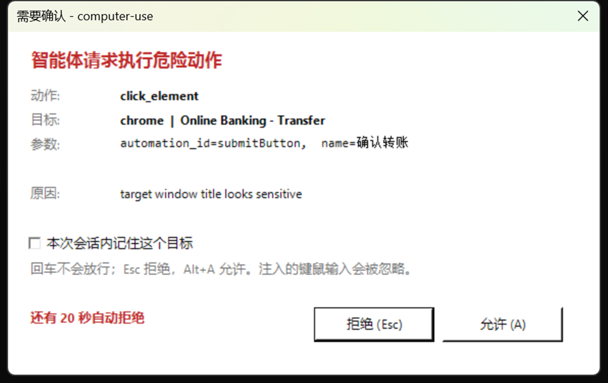
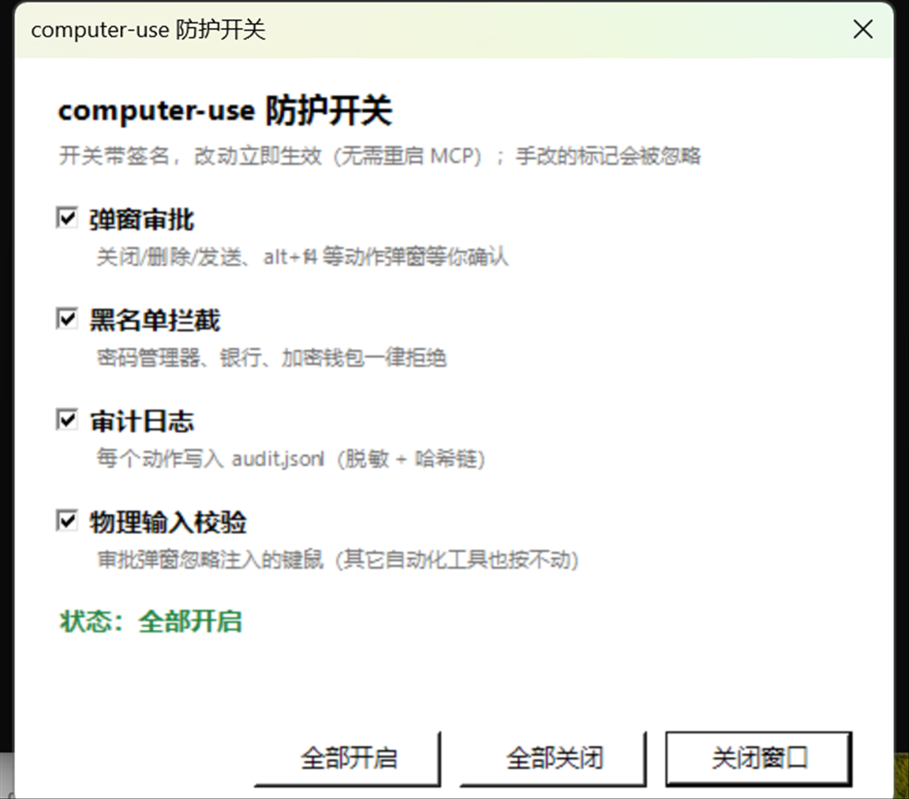

# guarded-computer-use-mcp

[English](README.md) · 中文

**给智能体一双手，但不交出钥匙。**

Windows 桌面控制 MCP 服务，**危险动作会停下来等真人点击**。26 个工具：截图、鼠标、键盘、UI Automation、OCR、窗口、剪贴板。

**没有任何第三方自动化代码**——所有能力由本目录的 `host.ps1`（C# + Win32）实现，唯一依赖是官方的 `@modelcontextprotocol/sdk`。

## 安装

需要 **Windows 10/11** + **Node.js ≥ 18**：

```bash
git clone https://github.com/be1st6666/guarded-computer-use-mcp
cd guarded-computer-use-mcp
npm install
```

建议装 **PowerShell 7**（UTF-8 和 JSON 处理更好），没有会自动退回 Windows PowerShell 5.1。

**OCR 可选**：需要 [`uv`](https://docs.astral.sh/uv/) 在 PATH 里。没有它其它功能照常工作。

装完先自测：

```bash
npm test              # 只读工具，无副作用
npm run test:policy   # 策略表，29 个样本
```

### 接进你的 MCP 客户端

**Claude Desktop / Cursor / 任何 stdio 客户端**：

```json
{
  "mcpServers": {
    "computer": {
      "command": "node",
      "args": ["D:/path/to/guarded-computer-use-mcp/server.js"]
    }
  }
}
```

**DeepSeek Harness (DSH)** —— 加到 `$DSH_HOME/profiles/web/cordis.patch.yml`：

```yaml
- insert:
    - id: mcp-computer-use
      name: '@deepseek-ai/dsh-mcp-client'
      config:
        serverName: computer
        transport: stdio
        command: C:/Program Files/nodejs/node.exe
        args:
          - D:/path/to/guarded-computer-use-mcp/server.js
```

工具会以 `mcp__computer__<名字>` 出现。

## 文件

| 文件 | 作用 |
|---|---|
| `server.js` | MCP 服务端，stdio JSON-RPC，26 个工具 |
| `host.ps1` | 常驻 PowerShell 宿主 + C# 帮助类（**必须保持纯 ASCII**，见下） |
| `ocr.ps1` | Windows 自带 OCR 后端（只能跑在 PowerShell 5.1） |
| `ocr_rapid.py` | RapidOCR 后端（PaddleOCR 模型 + ONNXRuntime，中文强） |
| `approval.ps1` | 审批对话框 |
| `guard-panel.ps1` / `.cmd` | 三个防护开关的面板 |
| `policy.json` | 四张策略表 |
| `test-client.js` | 测试客户端（`read` / `notepad` / `advanced` / `uia` / `newtools` / `rapid` / `policy`） |
| `test-policy.mjs` | 策略表匹配自测 |
| `bench.js` | 逐 op 延迟 + token 成本基准 |

## 架构

```
MCP client (DSH)
   │  stdio, JSON-RPC
   ▼
server.js ──── 一行 base64(UTF-8 JSON) 请求 ────▶ host.ps1（常驻进程）
   ▲                                                     │
   └──────── 一行 base64(UTF-8 JSON) 响应 ◀──────────────┘
                                                         │
                                              C# 类 Dsh（启动时编译一次）
                                                         │
                                          StretchBlt / SendInput / user32
```

四个关键设计：

1. **常驻宿主 + 一次性编译**
   C# 帮助类在宿主启动时 `Add-Type` 一次。实测：首次约 1.1s（编译），之后**每次调用 3–12ms**。
   对照：每次调用都重新起 PowerShell 的实现是 300–500ms。

2. **StretchBlt 一步完成抓取 + 缩放**
   早期版本先 `CopyFromScreen` 抓全尺寸（2560×1600），再用 `DrawImage` 缩到 1600。
   基准测试显示**缩放本身就要 57ms**，比编码还贵。改成一次 `StretchBlt` 直接抓到目标尺寸后，
   这段开销消失。

3. **默认 JPEG**
   PNG 编码 1600×1000 要 19–33ms，JPEG q88 只要 **4.3ms**，体积也小一半。
   `zoom` 抓小区域时可指定 `format: "png"` 要无损。

4. **base64 传输层**
   stdin/stdout 每行都是 base64，协议线上全是 ASCII，绕开控制台编码问题。

## 运行环境

宿主优先使用 **PowerShell 7**，找不到再回退 Windows PowerShell 5.1：

```
pwsh.exe  →  C:\Users\18858\PowerShell7\PowerShell\7\pwsh.exe  →  powershell.exe
```

可用 `COMPUTER_USE_SHELL` 环境变量强制指定。实测两版在截图性能上**没有实质差异**
（capture 60ms vs 66ms，run-to-run 波动更大），选 7 是语言层面的收益。

**注意 `-ReferencedAssemblies` 在两版上行为不同**：

| | 行为 | 需要的引用 |
|---|---|---|
| 5.1 | **追加**到默认引用集 | `System.Drawing, System.Windows.Forms` |
| 7.x | **替换**默认引用集 | 必须列全：`System.Drawing.Common, System.Drawing.Primitives, System.Windows.Forms, System.Private.Windows.Core, System.Private.Windows.GdiPlus, System.Collections, System.Runtime, System.Runtime.InteropServices, System.Diagnostics.Process, System.ComponentModel.Primitives, System.Text.Encoding.Extensions, System.Memory, System.Linq, System.Threading.Thread` |

`host.ps1` 按 `$PSVersionTable.PSEdition` 自动选择。

## 性能（实测，2560×1600 屏）

| 操作 | 耗时 |
|---|---|
| `cursor_position` / `list_windows` / `active_window` | 4–10ms |
| `zoom` 小区域（400×200） | 13ms |
| 全屏截图 → 1600×1000 JPEG | **99ms**（capture 58 + encode 4 + 传输） |
| 全屏截图 → 900×562 JPEG | 58ms |
| `screen_hash` | 40ms |
| `batch` 四步（含一次截图） | **90ms，一次往返** |

capture 的 ~55ms 是 GPU→CPU 读回整屏的物理下限，GDI 路径没法再降。
想再快只能上 DXGI Desktop Duplication，那需要 native addon。

## 工具（26 个）

| 类别 | 工具 |
|---|---|
| 观察 | `screenshot` `zoom` `screen_hash` `wait_for_change` `cursor_position` `list_displays` `list_windows` `active_window` `clipboard_read` |
| **语义定位** | **`find_elements` `click_element` `ui_tree`** |
| **OCR** | **`ocr`**（双引擎，见下） |
| 鼠标 | `mouse_move` `click` `drag` `scroll` |
| 键盘 | `type_text` `key` `hold_key` |
| 窗口/启动 | `activate_window` `launch_app` |
| 编排 | `batch` `wait` |
| 其他 | `clipboard_write` `bench` |

坐标一律是**虚拟桌面的物理像素**（本机 2560×1600）。

### OCR：第三条路

控件树拿不到（canvas/游戏/网页）、视觉模型又读不准小字时的兜底。两个引擎：

| 引擎 | 原理 | 实测（计算器按钮区） | 耗时 |
|---|---|---|---|
| `windows`（系统自带） | Windows.Media.Ocr | **0 个词** | 566ms |
| `rapidocr`（默认） | PaddleOCR 模型跑在 ONNXRuntime | **14 个词，全部正确** | 2.2s |

系统 OCR 是**按文档文本调优的**——它读得出计算器的小标签（`MC`/`CE`），却读不出大号数字按钮，
降采样也没救回来。RapidOCR 直接全读出来，还带置信度：

```
"7"@[125,553,18,26] score=1.0    "8"@[242,554,19,25] score=1.0
"+"@[478,712,20,22] score=0.777  "×"@[478,553,20,21] score=0.585
```

**box 是屏幕坐标，所以识别出来的词可以直接点。** 实测：OCR 找到 `7` → 点它的中心 → 截图显示 `7` ✓。

**常驻 worker**：每次新起 Python 进程要重付约 500ms 的模型初始化，所以 `ocr_rapid.py --serve`
以常驻模式运行，server.js 通过管道按行收发：

| | 延迟 | 内存 |
|---|---|---|
| 首次（含启动+初始化） | 3.2s | — |
| 后续调用 | **350ms** | — |
| worker 存活时 | — | **96 MB** |
| 空闲 60s 后 | 自动退出 | **释放** |

空闲时长由 `COMPUTER_USE_OCR_IDLE_MS` 控制（默认 60000）。首次运行 uv 会下载
ONNXRuntime 和模型（约 70MB，之后走缓存）。

### 安全闸门

危险动作**默认不执行**，返回 `pending_safety_check` 要求再调一次并显式传 `confirm: true`：

```json
{ "pending_safety_check": true, "action": "key", "arguments": {"combo":"alt+f4"},
  "reason": "key combo \"alt+f4\" is destructive",
  "how_to_proceed": "Re-issue the same call with confirm: true after the user agrees." }
```

触发条件：
- `key` / `hold_key`：`alt+f4`、`ctrl+w`、`win+*`、`shift+delete`、`delete` …
- `click_element`：目标名字含 关闭/删除/卸载/发送/提交/支付/确认… 或 close/delete/send/submit…
- `click`：右键（会弹出带危险项的菜单）

`batch` 内部同样受管控：被拦的步骤会记为 `BLOCKED` 并跳过。

### 弹窗审批（真正的人机确认）

安全闸门触发时，**弹一个真实的 Windows 对话框**，MCP 服务端阻塞等它的退出码：



**设计上保证"误按键不可能放行"**：

| 按键 | 效果 |
|---|---|
| `Enter` | **无效**——故意不绑定 |
| `Esc` / 关闭按钮 | 拒绝 |
| `Alt+A` / 点「允许」 | 允许 |
| 超时无应答 | 自动拒绝（界面显示倒计时） |

弹窗还会显示**真正要执行的参数**（`automationId=…`、`name=…`），
跟随系统语言（中文/英文），有提示音，且始终置顶。
勾选「本次会话内记住这个目标」后，同一个「工具+目标」组合在本次运行内不再询问。

退出码：`0` 允许一次 / `1` 拒绝 / `2` 超时自动拒绝 / `3` 弹窗不可用（退回待确认状态）/ `4` 允许并记住本次会话。

**为什么这比 `confirm: true` 强**：`confirm` 是模型自己填的参数，模型可以绕过；
而对话框**只有真人操作才能放行**——模型无法伪造一次人类点击。

**开关**（`approval-toggle.ps1`，双击同目录的 `toggle-approval.cmd`）：

| 操作 | 效果 |
|---|---|
| 默认 | 弹窗审批开启 |
| 运行一次 | 创建 `.approval-off` → **关闭审批**，危险动作只返回待确认，不弹窗 |
| 再运行一次 | 删除该文件 → 恢复弹窗 |

开关**故意不做成 MCP 工具**——否则模型能自己把它关掉，等于没做。

配置在 `policy.json`：

```json
"approval": { "enabled": true, "timeout_ms": 30000 }
```

实测（通过 MCP 触发关闭计算器）：

```
弹窗出现 → 点击 Allow → 动作执行 → 计算器关闭 → 审计 ok=true
```

### 策略与审计（爆炸半径控制）

**"控制真机" 和 "完全隔离" 架构上互斥**——Codex 能隔离，是因为它控制的是沙箱里的桌面，不是你的。
所以这里做的是**压缩爆炸半径**。`policy.json` 里有**四张表**，全部是子串匹配、大小写不敏感：

| 表 | 行为 | 默认覆盖 | 条目 |
|---|---|---|---|
| `deny_processes` | **硬拒绝，无法绕过** | 密码管理器、加密钱包、`regedit`/`diskmgmt`/`diskpart`/`gpedit` | 49 |
| `deny_window_titles` | **硬拒绝** | `password`/`bank`/`pay`/`wallet`/`转账`/`验证码`/助记词/UAC | 31 |
| `approval_processes` | **每个动作都弹窗** | 通讯（微信/QQ/Telegram/Slack…）、邮件、远程桌面 | 32 |
| `approval_window_titles` | **每个动作都弹窗** | `send`/`发送`/`remote desktop` | 8 |

**为什么要拆成两档**：微信这类应用**不该被完全禁止**（你可能想让我读或总结消息），
但也不该被随便点击——所以它进"必须审批"而不是"禁止"。

`npm run test:policy` 用 29 个样本验证这四张表，**既验证该命中的命中，也验证不该误伤的没误伤**
（浏览器、记事本、Blender、DSH 本身都必须干净通过）。

判定目标是 **`WindowFromPoint`**——点击真正落在哪个窗口上，不是猜：

```json
{ "blocked_by_policy": true, "reason": "target process is on the deny list",
  "detail": { "process": "ApplicationFrameHost", "title": "计算器", "matched": "applicationframehost" } }
```

审计记录（含目标进程）：

```
16:28:32  click            ApplicationFrameHost   ok=true
16:28:32  cursor_position  -                      ok=true
```

只读工具不受策略影响（它们不改状态）。

### 防护开关面板

双击 **`guard-panel.cmd`** 打开，三个开关互相独立：



| 开关 | 关闭后 | 标记文件 |
|---|---|---|
| 弹窗审批 | 危险动作返回"待确认"，不弹窗 | `.approval-off` |
| 黑名单拦截 | 黑名单与速率限制跳过 | `.guard-off` |
| 审计日志 | 不写 `audit.jsonl` | `.audit-off` |

服务端**每次调用都读标记文件**，所以点完立即生效，**不用重启 MCP**。
（改 `policy.json` 里的名单仍需重启。）

三者**完全独立**：关掉黑名单**不会**把弹窗也关掉。

### 语义定位 vs 坐标点击

**坐标法有个致命缺陷：点错了不会告诉你。** 窗口移动、分辨率变化、DPI 缩放都会让坐标静默失效，
而模型以为自己成功了。

`find_elements` / `click_element` 走 UI Automation 控件树，按名字/类型/AutomationId 定位：

```
find_elements { window: "计算器", control_type: "button" }
  -> Button "一" automationId=num1Button  center=[134,723]
  -> Button "加" automationId=plusButton  center=[488,723]
  -> Button "等于" automationId=equalButton center=[488,801]

click_element { window: "计算器", automation_id: "plusButton" }
  -> {"how":"invoke"}      <- InvokePattern，连鼠标都不用动
```

`click_element` 优先 `InvokePattern`（直接触发控件，不移动指针），控件不支持时才退回鼠标点击中心。

**实测对比**（同一道 12+3）：

| | 坐标点击 | 语义定位 |
|---|---|---|
| 首次成功率 | 失败（点出 `11`） | **一次成功** |
| 是否移动鼠标 | 是 | 否（InvokePattern） |
| 窗口移动后 | 静默点错 | 仍然正确 |
| 找不到时 | 点空、无反馈 | 明确报错 |

**控件树实际能覆盖什么**——很容易想当然地认为"浏览器读不到"，于是过早退回像素。
实测下来 **Edge/Chromium 是会暴露页面的**：在 4399.com 的游戏索引页上，一次
`find_elements` 就返回了 22 个带精确矩形的超链接，包括页面下方一万多像素处的
offscreen 元素，全部可以按名字点击、鼠标一动不动。

**仍然读不到的**：

| | 可读？ |
|---|---|
| 静态 HTML 链接/按钮/输入框 | ✅ |
| 原生 Win32 / WPF / UIA 应用 | ✅ |
| `canvas` / WebGL / 游戏画面 | ❌ |
| 尚未挂载的虚拟列表 | ❌ |
| 自绘工具栏（不少国产桌面软件） | ❌ |

读不到时依次退回 `ocr`、再退回坐标。

**三级降级策略**：

1. `find_elements` / `click_element` —— 有控件树就用，最可靠
2. `ocr` —— 没控件树但有文字，读出来按坐标点
3. `screenshot` + 坐标 —— 前两者都不行时的最后手段


### 事件驱动，不是连续视觉流

Codex 的 computer use 也不是连续视频流——它同样是"动作 → 截图 → 判断"的循环。本实现提供三件套：

- **`screen_hash`** —— 64×40 感知指纹，40ms，不消耗 token。调用 → 操作 → 再调用，hash 变了就说明屏幕真变了。
- **`wait_for_change`** —— 阻塞到屏幕真的变化才返回，替代"睡一会儿再截图"。模型不轮询，不浪费回合。
- **`batch`** —— `[click, wait, screenshot]` 一次调用拿到操作后的状态，省掉往返。

### 修掉的坑

1. **`scroll` 向下崩溃**（旧包）
   `dwData` 被声明成 `uint` 却传负数。本实现用 `unchecked((uint)(notches * 120))`。

2. **文本输入不转义单引号**（旧包）
   旧包走 `SendKeys` 字符串插值，输入 `it's` 就破坏 PowerShell 语法。
   本实现走 `SendInput` + `KEYEVENTF_UNICODE` 逐字符注入，中文、单引号、emoji 全部原样送出。

3. **`host.ps1` 必须是纯 ASCII**
   Windows PowerShell 5.1 读取**无 BOM 的 .ps1 会按 ANSI 解码**，一个中文字符被拆成 GBK 字节后
   可能吞掉换行，把下一行代码并进注释里（我们真的踩到了）。
   校验：`((Get-Content .\host.ps1 -Encoding Byte -ReadCount 0) | Where-Object { $_ -gt 127 }).Count` 必须是 0。

4. **PowerShell 5.1 的 `ConvertFrom-Json` 处理不了几百 KB 的字符串**
   它会报 `Invalid object passed in, ':' or '}' expected`，而且**错误消息里会把整个 payload 带出来**
   （一度把我的终端刷爆）。
   所以 `Shot()` 改成返回**换行分隔的裸字段**，由 PowerShell 手工 split，全程不碰 JSON 解析。

## 测试

```bash
npm test                      # 只读工具，无副作用
npm run test:uia              # 控件树 + 语义搜索
npm run test:policy           # 四张策略表，29 个样本，误伤即失败
npm run bench                 # 延迟 + token 成本表
node test-client.js policy    # 策略与审计端到端
node test-client.js rapid     # 系统 OCR vs RapidOCR 同区域对比
node test-client.js newtools  # launch_app / 审批闸门 / OCR 驱动点击
```

`docs/make-*.ps1` 可以从**当前屏幕**重新生成 README 里的图，所以截图不是手绘的，
随时可复现。

`notepad` 阶段验证 Unicode 输入：

```
type_text  输入  DSH MCP test: it's ok | 中文测试 🎋
剪贴板回读  逐字符一致 ✓
```

## 已知限制

- **仅 Windows**。
- **全屏截图约 55ms 是物理下限**（整屏 GPU→CPU 读回）。上 DXGI Desktop Duplication 能再快，但要写 native addon。
- **没有连续视觉流**：只在主动截图的那一刻看到画面（这是设计选择）。
- **不是沙箱**：智能体以你的用户权限操作你的真实桌面，没有 VM。
- **提权窗口碰不到**：UIPI 拦截向管理员窗口注入输入，UAC 安全桌面更进不去。
- **`type_text` 依赖焦点**：输入前先 `activate_window` + `click` 定位。
- **OCR 约 0.5–2.5 秒**，取决于常驻 worker 是否还活着。

## DSH 接线

`C:\Users\18858\.dsh\profiles\web\cordis.patch.yml`：

```yaml
- insert:
    - id: mcp-computer-use
      name: '@deepseek-ai/dsh-mcp-client'
      config:
        serverName: computer
        transport: stdio
        command: C:/Program Files/nodejs/node.exe
        args:
          - D:/dsh-workspace/computer-use-mcp/server.js
        cwd: D:/dsh-workspace/computer-use-mcp/
```

工具在 DSH 侧的名字是 `mcp__computer__<tool>`。配置热重载，改完约 10 秒内重连。
